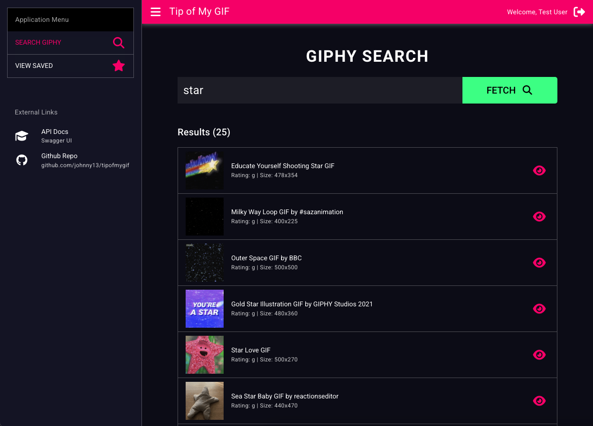

# tipofmygif



> **Save, rate and categorize Giphy gifs for easy retrieval later.**

## 🎯 About

_**NOTE** This is an example project not inteded for real world use._

Tip of My GIF can be used for managing and organizing your favorite GIFs from Giphy. Ever had that moment where you remember a perfect GIF but can't find it? This project solves that problem by allowing you to save, rate, and categorize GIFs with your own comments and ratings, making them easily searchable later.

### ✨ Features

- **🔍 Giphy Integration**: Search and browse millions of GIFs from Giphy
- **💾 Save & Organize**: Save your favorite GIFs to your personal collection
- **⭐ Rate & Review**: Rate GIFs (1-5 stars) and add personal comments
- **🏷️ Smart Categorization**: Organize GIFs with custom tags and descriptions
- **🔎 Advanced Search**: Find saved GIFs by rating, comments, or tags
- **🔐 User Accounts**: Secure authentication with personal collections
- **📱 Responsive Design**: Works on desktop and mobile devices

## 🏗️ Project Structure

This project consists of two main components:

```
tipofmygif/
├── 📁 giphy-api/          # Backend API (Laravel + Sail)
│   ├── 🐳 Laravel Sail    # Docker-based development environment
│   ├── 🔐 Laravel Sanctum # API authentication
│   ├── 📚 OpenAPI/Swagger # Interactive API documentation
│   ├── 🗄️ MariaDB        # Database
│   └── 📧 Mailpit         # Email testing
├── 📁 frontend/           # Frontend Application (Coming Soon)
│   ├── 🎨 Modern UI       # User interface
│   ├── 📱 Responsive      # Mobile-friendly design
│   └── 🔗 API Integration # Backend connectivity
└── 📄 README.md           # This file
```

### 🔧 Backend (giphy-api/)

The backend is a **Laravel-based REST API** powered by Laravel Sail for easy development:

- **Framework**: Laravel 11 with Laravel Sail
- **Database**: MariaDB (MySQL compatible)
- **Authentication**: Laravel Sanctum (API tokens)
- **Documentation**: OpenAPI/Swagger with interactive UI
- **Development**: Docker-based with hot reloading

### 🎨 Frontend (frontend/)

The frontend will provides a modern, responsive web interface for:
- Browsing and searching Giphy GIFs
- Managing your saved GIF collection
- Rating and commenting on GIFs
- Advanced search and filtering

## 🚀 Getting Started

### Prerequisites

- **Docker Desktop** - [Download here](https://www.docker.com/products/docker-desktop/)
- **Giphy API Key** - [Get one here](https://developers.giphy.com/)
- **Git** - [Download here](https://git-scm.com/downloads)
- **Node** - [Download here](https://nodejs.org/)

 
#### 🔑 API Key Setup

Get a **Giphy API Key** setup and enabled:

 **Get a Giphy API Key**:
   - Visit [Giphy Developers](https://developers.giphy.com/)
   - Create an account and register your app
   - Copy your API key


### Installation

1. **Clone the repository**
```bash
git clone <repository-url>
cd tipofmygif
``` 

1b. **.env file setup**
```bash
cd giphy-api
cp .env.example .env
# configure the database. I recommend the sail defaults for mysql
# Edit .env and add your Giphy API key
GIPHY_API_KEY=your_giphy_api_key_here
```

2. **Setup the backend**
```bash
# still from the giphy-api directory
composer install
./vendor/bin/sail up -d # assuming docker is installed and running
./vendor/bin/sail artisan migrate --seed
./generate-api-docs.sh
   ```

2b. **Access the application API**
   - **Backend API**: http://localhost:8000
   - **API Documentation**: http://localhost:8000/api/documentation
   - **Test Users**: See [Backend README](giphy-api/README.md#-available-test-users)

3. **Setup the frontend**
```bash
cd frontend
npm install
npm run dev # browser should open to quasar app @ http://localhost:9001
```

3b. **Access the application UI**
   - **Frontend**: http://localhost:9001


## 📚 Additional Documentation

- **[Backend API Documentation](giphy-api/README.md)** - Complete Laravel Sail setup and API guide
- **[Swagger UI](http://localhost:8000/api/documentation)** - Interactive API documentation
- **[OpenAPI Specification](giphy-api/storage/api-docs/api-docs.json)** - Machine-readable API spec
- **[Frontend App Documentation](frontend/README.md)** - Details for the Quasar v2 w/ Typescript UI


## 🤝 Contributing

1. Fork the repository
2. Create a feature branch (`git checkout -b feature/amazing-feature`)
3. Commit your changes (`git commit -m 'Add amazing feature'`)
4. Push to the branch (`git push origin feature/amazing-feature`)
5. Open a Pull Request

## 📄 License

This project is licensed under the MIT License - see the [LICENSE](LICENSE) file for details.

## 🙏 Acknowledgments

- [Giphy](https://giphy.com/) for providing the GIF API
- [Laravel](https://laravel.com/) for the amazing PHP framework
- [Laravel Sail](https://laravel.com/docs/sail) for the Docker development environment
- [Laravel Sanctum](https://laravel.com/docs/sanctum) for API authentication 

---


