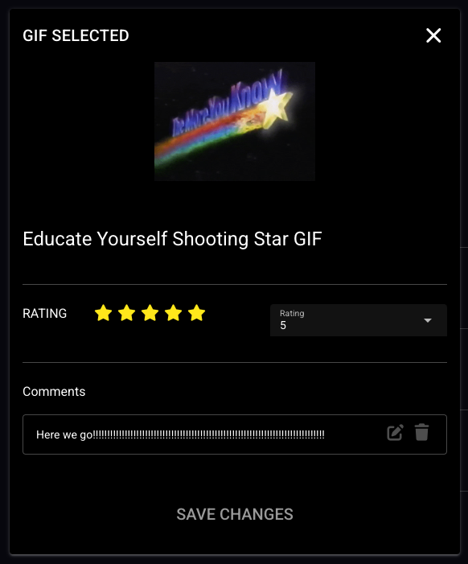

# Quasar App

The front end uses the Quasar framework and is written in Typescript. The Node requirement is set in the `.nvmrc` file at v20. Other than that the only other requirement is having the backend up and running. 

## Install the dependencies

```bash
yarn
# or
npm install
```

### Start the app in development mode (hot-code reloading, error reporting, etc.)

```bash
quasar dev
```

### Functionality

The main point of the app is allowing you to save Customized Gifs to your account. Customized, in that that each gif can have a numerical rating and multiple comments, along with all the regular Giphy data.

Here is a quick preview of what we are talking about 



### Pages vs Components

This is setup w/ a 'page' heavy setup, rather than being a single page app that uses components. The reasoning being readability and IMHO its easier to develop this way and wait until some commonality arises, and then make that into a component. 

Axios is used to handle all the API requests. So posting, getting etc are all really easy to do. Like grabbingn all the users saved gifs is done like so

```typescript
const response = await api.get('/api/gifs/my')
```

#### API NOTE

When returning saved data, each Gif automatically includes the user rating, and user comments for the Gif, there is no need to check the Comments table and Ratings table for each saved Gif.

```php
return response()->json([
  'message' => 'GIF saved successfully',
  'gif' => $gif->load(['user', 'ratings', 'comments'])
], 201);
```

While still keeping ratings and comments in their own respective tables. For example to save a rating to saved Gif we do this in the UI

```typescript
// Save the rating
await api.post('/api/ratings', {
  gif_id: selectedGif.value.giphy_id,
  rating: previewRatingsSelectModel.value
})
```

### Extra Quasar Information

here is a bit more info and available commands for the Quasar framework. 

#### Lint the files

```bash
yarn lint
# or
npm run lint
```

#### Format the files

```bash
yarn format
# or
npm run format
```

#### Build the app for production

```bash
quasar build
```

#### Customize the configuration

See [Configuring quasar.config.js](https://v2.quasar.dev/quasar-cli-vite/quasar-config-js).
